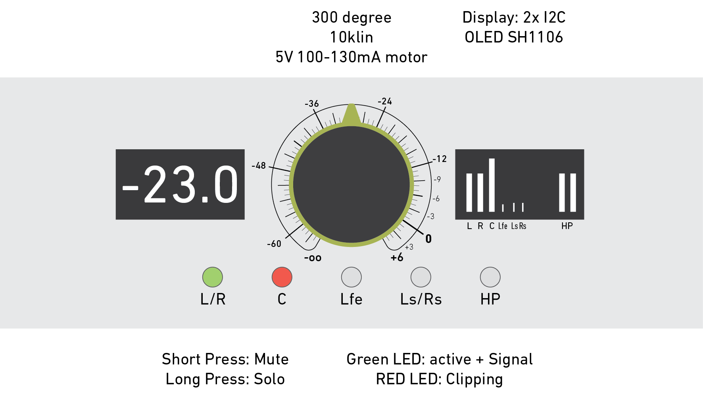
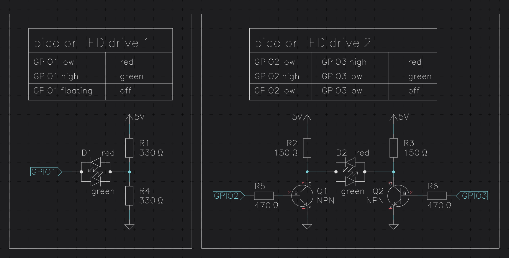
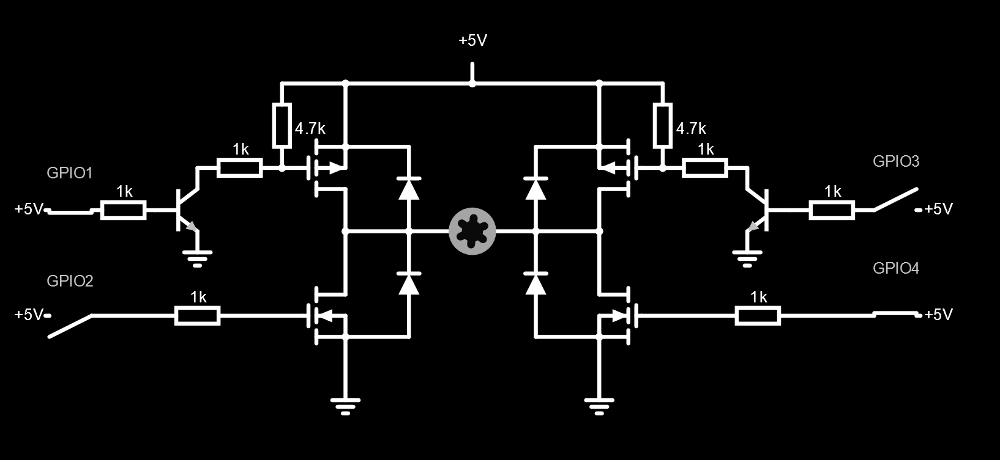
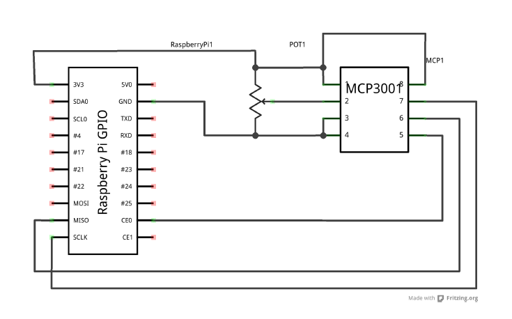

# cineface

Cineface is a Hardware OSC Controller for the RME Totalmix outputs.

I use the _RME Fireface UC_ USB sound interface studio for 5.1 Surround mixing (for film/cinema audio). It is a great piece of hardware which allows it's users to OSC-control the mixer interface. To for quicker and more reliable work I wanted to create a hardware controller that allows me to see which outputs are currently muted, unmuted, to quickly see what level all of the outputs are set to and to change all of them at once with one dial (as opposed to 6 faders on the TotalMix interface).

Hardware wise I planned to have:

- 1x Raspberry Pi 3 for all the interfacing
- 5x LED Buttons (L/R, Center, Lfe, Ls/Rs, Headphones) for muting (green light means active, no light means off)
- 1x Motor Potentiometer, for global volume control (if I select snapshots from TotalMix it should update)
- 2x OLED Displays, one for displaying the dB value and one for displaying the current peak levels of the channels

It is meant to run on a raspberry pi 3 and look a bit like this:

## Current State of Affairs

- [x] Receiving OSC from TotalMix (reacting to UI change) via Network
- [x] Sending OSC to TotalMix (remotely changing the UI) via Network
- [x] Button/LED Implementation
- [ ] db-Display Implementation
- [ ] levels-Display Implementation
- [ ] Potentiometer (ADC) Implementation
- [ ] Potentiometer (Motor) Implementation
- [ ] Building a Case

## Raspberry Pi Pinout

| Pin  | GPIO              | Function              |
| ---- | ----------------- | --------------------- |
| 6    | GND               | Buttons/LEDs GND      |
| 38   | GPIO 20           | Button (speakers L/R) |
| 40   | GPIO 21           | LED (speakers L/R)    |
| 8    | GPIO 14           | Button (center)       |
| 10   | GPIO 15           | LED (center)          |
| 12   | GPIO 18           | Button (Lfe)          |
| 11   | GPIO 17           | LED (Lfe)             |
| 16   | GPIO 23           | Button (rear)         |
| 15   | GPIO 22           | LED (rear)            |
| 22   | GPIO 25           | Button (Headphones)   |
| 24   | GPIO 24           | LED (Headphones)      |
| 3    | GPIO 2 (I2C1 SDA) | OLED Displays SDA     |
| 5    | GPIO 3 (I2C1 SCL) | OLED Displays SCL     |
| 1    | 3.3 V             | OLED Displays Vcc     |
| 39   | GND               | OLED Displays GND     |
| 32   | GPIO 12 (PWM)     | L293D EN1             |
| ?    | GPIO ?            | L293D IN1             |
| ?    | GPIO ?            | L293D IN2             |
|      | GND               | L293D GND             |
| 21   | GPIO 9 (MISO)     | MCP3001 ADC Pin 6     |
| 23   | GPIO 11 (SCLK)    | MCP3001 ADC Pin 5     |
|      | 3.3 V             | MCP3001ADC            |
|      | GND               | MCP3001ADC            |

## Buttons

I use switches with a two-terminal bicolor LED inside (red/green). I am only going to use the green part to display whether a channel is unmuted (green) or muted (off). However one could also use both colors from a raspi as follows (e.g. to indicate clipping):

For the switches I am using the raspi internal pull-up-resistor.

## Motor Potentiometer

A motor Potentiometer is a potentiometer coupled to a motor. This means we can read out the current dial position of the potentiometer using an ADC and set the Volume of TotalMix accordingly. Should we change the volume in the TotalMix UI or load up a different snapshot we can use the motor to move the dial into a position where it represents the GUI volume again. This means the motor potentiometer consists of two parts:

### 1. Driving the motor

Drive motor with H-Bridge (for Simulation [see here](https://tinyurl.com/yc7tqva5)):

Or use an chip like the [L293](https://www.ti.com/product/L293) see instructions for how to use it with a raspi [here](https://sandstorm.de/de/blog/post/diy-raspberry-pi-l293d-motorsteuerung.html) (this is what I am going to do, as it takes up less space and I would have had to order P-channel MOSFETs anyways). The principle with the L293 remains the same, it is just less soldering.

### 2. Reading out the dial

I decided on using a MCP3001 which is a 1-channel 10bit ADC with SPI connector:

## Displays

Check out [this library](https://github.com/bitbank2/ss_oled) which allows you to drive multiple I2C displays from the same pins

